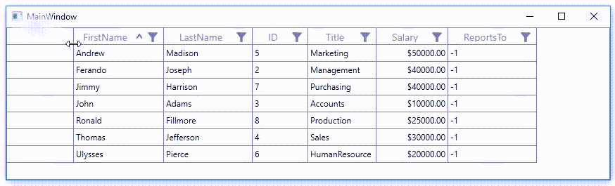

# How to Resize the Row Header Column in WPF DataGrid?	

This example illustrates how to resize the row header column in [WPF DataGrid](https://www.syncfusion.com/wpf-controls/datagrid) (SfDataGrid).

[WPF DataGrid](https://www.syncfusion.com/wpf-ui-controls/datagrid) (SfDataGrid) does not provide the direct support to resize the row header column. You can resize the row header column by overriding the [GridRowHeaderCell](https://help.syncfusion.com/cr/cref_files/wpf/Syncfusion.SfGrid.WPF~Syncfusion.UI.Xaml.Grid.GridRowHeaderCell.html) and [GridRowHeaderIndentCell](https://help.syncfusion.com/cr/cref_files/wpf/Syncfusion.SfGrid.WPF~Syncfusion.UI.Xaml.Grid.GridRowHeaderIndentCell.html) by triggering the **Thumb.DragDelta** event.

```xml
 <Window.Resources>
        <Style TargetType="syncfusion:GridRowHeaderCell">
            <Setter Property="Background" Value="Transparent" />
            <Setter Property="BorderBrush" Value="Gray" />
            <Setter Property="BorderThickness" Value="0,0,1,1" />
            <Setter Property="Padding" Value="0,0,0,0" />
            <Setter Property="FocusVisualStyle" Value="{x:Null}" />
            <Setter Property="IsTabStop" Value="False" />
            <Setter Property="Template">
                <Setter.Value>
                    <ControlTemplate TargetType="syncfusion:GridRowHeaderCell">
                        <Grid>
                            <Border x:Name="PART_RowHeaderCellBorder"
                            Background="{TemplateBinding Background}"
                            BorderBrush="{TemplateBinding BorderBrush}"
                            BorderThickness="{TemplateBinding BorderThickness}">

                                <VisualStateManager.VisualStateGroups>

                                    <VisualStateGroup x:Name="BorderStates">
                                        <VisualState x:Name="NormalCell"/>
                                        <VisualState x:Name="TableSummaryCell">
                                            <Storyboard BeginTime="0">
                                                <ThicknessAnimationUsingKeyFrames Storyboard.TargetName="PART_RowHeaderCellBorder" Storyboard.TargetProperty="(Border.BorderThickness)">
                                                    <EasingThicknessKeyFrame KeyTime="0" Value="0" />
                                                </ThicknessAnimationUsingKeyFrames>
                                            </Storyboard>
                                        </VisualState>
                                        <VisualState x:Name="Fixed_NormalCell">
                                            <Storyboard BeginTime="0">
                                                <ThicknessAnimationUsingKeyFrames BeginTime="0"
                                                                          Duration="1"
                                                                          Storyboard.TargetName="PART_RowHeaderCellBorder"
                                                                          Storyboard.TargetProperty="BorderThickness">
                                                    <EasingThicknessKeyFrame KeyTime="0" Value="0, 1, 1, 1" />
                                                </ThicknessAnimationUsingKeyFrames>
                                            </Storyboard>
                                        </VisualState>
                                    </VisualStateGroup>

                                    <VisualStateGroup x:Name="IndicationStates">
                                        <VisualState x:Name="Normal">
                                        </VisualState>

                                        <VisualState x:Name="Error_CurrentRow">
                                            <Storyboard>
                                                <ObjectAnimationUsingKeyFrames Storyboard.TargetName="PART_RowHeaderIndicator" Storyboard.TargetProperty="Data">
                                                    <DiscreteObjectKeyFrame KeyTime="0">
                                                        <DiscreteObjectKeyFrame.Value>
                                                            <Geometry>F1 M 397.333,276.552L 395.445,274.666L 392,278.112L 388.555,274.666L 386.667,276.552L 390.113,279.999L 386.667,283.445L 388.555,285.334L 392,281.887L 395.445,285.334L 397.333,283.445L 393.887,279.999L 397.333,276.552 Z</Geometry>
                                                        </DiscreteObjectKeyFrame.Value>
                                                    </DiscreteObjectKeyFrame>
                                                </ObjectAnimationUsingKeyFrames>

                                                <ColorAnimationUsingKeyFrames Storyboard.TargetName="PART_RowHeaderIndicator" Storyboard.TargetProperty="(Shape.Fill).(SolidColorBrush.Color)">
                                                    <EasingColorKeyFrame KeyTime="0" Value="#FFFF3D2E" />
                                                </ColorAnimationUsingKeyFrames>
                                            </Storyboard>
                                        </VisualState>

                                        <VisualState x:Name="Error">
                                            <Storyboard>
                                                <ObjectAnimationUsingKeyFrames Storyboard.TargetName="PART_RowHeaderIndicator" Storyboard.TargetProperty="Data">
                                                    <DiscreteObjectKeyFrame KeyTime="0">
                                                        <DiscreteObjectKeyFrame.Value>
                                                            <Geometry>F1 M 397.333,276.552L 395.445,274.666L 392,278.112L 388.555,274.666L 386.667,276.552L 390.113,279.999L 386.667,283.445L 388.555,285.334L 392,281.887L 395.445,285.334L 397.333,283.445L 393.887,279.999L 397.333,276.552 Z</Geometry>
                                                        </DiscreteObjectKeyFrame.Value>
                                                    </DiscreteObjectKeyFrame>
                                                </ObjectAnimationUsingKeyFrames>

                                                <ColorAnimationUsingKeyFrames Storyboard.TargetName="PART_RowHeaderIndicator" Storyboard.TargetProperty="(Shape.Fill).(SolidColorBrush.Color)">
                                                    <EasingColorKeyFrame KeyTime="0" Value="#FFEC777C" />
                                                </ColorAnimationUsingKeyFrames>

                                            </Storyboard>
                                        </VisualState>

                                        <VisualState x:Name="CurrentRow">
                                            <Storyboard>
                                                <ObjectAnimationUsingKeyFrames Storyboard.TargetName="PART_RowHeaderIndicator" Storyboard.TargetProperty="Data">
                                                    <DiscreteObjectKeyFrame KeyTime="0">
                                                        <DiscreteObjectKeyFrame.Value>
                                                            <Geometry>F1 M 390.741,274.667L 387.928,274.667L 393.048,280L 387.927,285.333L 390.741,285.333L 396.073,280L 390.741,274.667 Z</Geometry>
                                                        </DiscreteObjectKeyFrame.Value>
                                                    </DiscreteObjectKeyFrame>
                                                </ObjectAnimationUsingKeyFrames>

                                                <ObjectAnimationUsingKeyFrames Storyboard.TargetName="PART_ToolTip" Storyboard.TargetProperty="(UIElement.Visibility)">
                                                    <DiscreteObjectKeyFrame KeyTime="0">
                                                        <DiscreteObjectKeyFrame.Value>
                                                            <Visibility>Collapsed</Visibility>
                                                        </DiscreteObjectKeyFrame.Value>
                                                    </DiscreteObjectKeyFrame>
                                                </ObjectAnimationUsingKeyFrames>
                                            </Storyboard>
                                        </VisualState>

                                        <VisualState x:Name="EditingRow">
                                            <Storyboard>
                                                <ObjectAnimationUsingKeyFrames Storyboard.TargetName="PART_RowHeaderIndicator" Storyboard.TargetProperty="Data">
                                                    <DiscreteObjectKeyFrame KeyTime="0">
                                                        <DiscreteObjectKeyFrame.Value>
                                                            <Geometry>M6.8007798,1.7332839 L8.97791,3.9143763 2.8868401,10.034073 0,10.666874 0.70837402,7.8491302 z M9.1967516,0.00016105175 C9.5903473,-0.0053596497 9.9693098,0.13107061 10.251301,0.41431141 10.856801,1.0224026 10.794301,2.067961 10.110801,2.7515601 L7.9219999,0.5588423 C8.2858057,0.19500291 8.7506762,0.0064178705 9.1967516,0.00016105175z</Geometry>
                                                        </DiscreteObjectKeyFrame.Value>
                                                    </DiscreteObjectKeyFrame>
                                                </ObjectAnimationUsingKeyFrames>

                                                <ObjectAnimationUsingKeyFrames Storyboard.TargetName="PART_ToolTip" Storyboard.TargetProperty="(UIElement.Visibility)">
                                                    <DiscreteObjectKeyFrame KeyTime="0">
                                                        <DiscreteObjectKeyFrame.Value>
                                                            <Visibility>Collapsed</Visibility>
                                                        </DiscreteObjectKeyFrame.Value>
                                                    </DiscreteObjectKeyFrame>
                                                </ObjectAnimationUsingKeyFrames>

                                            </Storyboard>
                                        </VisualState>
                                        <VisualState x:Name="AddNewRow">
                                            <Storyboard>
                                                <ObjectAnimationUsingKeyFrames Storyboard.TargetName="PART_RowHeaderIndicator" Storyboard.TargetProperty="Data">
                                                    <DiscreteObjectKeyFrame KeyTime="0">
                                                        <DiscreteObjectKeyFrame.Value>
                                                            <Geometry>F1 M 397.333,278.825L 393.176,278.825L 393.176,274.667L 390.824,274.667L 390.824,278.825L 386.667,278.825L 386.667,281.175L 390.824,281.175L 390.824,285.333L 393.176,285.333L 393.176,281.175L 397.333,281.175L 397.333,278.825 Z</Geometry>
                                                        </DiscreteObjectKeyFrame.Value>
                                                    </DiscreteObjectKeyFrame>
                                                </ObjectAnimationUsingKeyFrames>

                                                <ObjectAnimationUsingKeyFrames Storyboard.TargetName="PART_ToolTip" Storyboard.TargetProperty="(UIElement.Visibility)">
                                                    <DiscreteObjectKeyFrame KeyTime="0">
                                                        <DiscreteObjectKeyFrame.Value>
                                                            <Visibility>Collapsed</Visibility>
                                                        </DiscreteObjectKeyFrame.Value>
                                                    </DiscreteObjectKeyFrame>
                                                </ObjectAnimationUsingKeyFrames>

                                            </Storyboard>
                                        </VisualState>
                                        <VisualState x:Name="FilterRow">
                                            <Storyboard>
                                                <ObjectAnimationUsingKeyFrames Storyboard.TargetName="PART_RowHeaderIndicator" Storyboard.TargetProperty="Data">
                                                    <DiscreteObjectKeyFrame KeyTime="0">
                                                        <DiscreteObjectKeyFrame.Value>
                                                            <Geometry>F1M12,6L12,7L13,7L13,8L14,8L14,9L15,9L15,13L17,14L17,9L18,9L18,8L19,8L19,7L20,7L20,6z</Geometry>
                                                        </DiscreteObjectKeyFrame.Value>
                                                    </DiscreteObjectKeyFrame>
                                                </ObjectAnimationUsingKeyFrames>

                                                <ObjectAnimationUsingKeyFrames Storyboard.TargetName="PART_ToolTip" Storyboard.TargetProperty="(UIElement.Visibility)">
                                                    <DiscreteObjectKeyFrame KeyTime="0">
                                                        <DiscreteObjectKeyFrame.Value>
                                                            <Visibility>Collapsed</Visibility>
                                                        </DiscreteObjectKeyFrame.Value>
                                                    </DiscreteObjectKeyFrame>
                                                </ObjectAnimationUsingKeyFrames>

                                            </Storyboard>
                                        </VisualState>
                                    </VisualStateGroup>
                                </VisualStateManager.VisualStateGroups>
                                <Path x:Name="PART_RowHeaderIndicator"
                              Width="8.146"
                              Height="8.146"
                              HorizontalAlignment="Center"
                              VerticalAlignment="Center"
                              Fill="#FF303030"
                              Stretch="Fill">
                                    <ToolTipService.ToolTip>

                                        <ToolTip x:Name="PART_ToolTip"
                                         Background="#FFDB000C"
                                         Placement="Left"
                                         PlacementRectangle="20,0,0,0"
                                         Tag="{TemplateBinding RowErrorMessage}"/>
                                    </ToolTipService.ToolTip>
                                </Path>
                            </Border>
                            <Thumb x:Name="PART_RightHeaderGripper" HorizontalAlignment="Right" DragDelta="PART_RightHeaderGripper_DragDelta" Tag="{Binding RelativeSource={RelativeSource Mode=FindAncestor, AncestorType={x:Type syncfusion:SfDataGrid}}}">

                                <Thumb.Style>
                                    <Style TargetType="{x:Type Thumb}">
                                        <Setter Property="Width" Value="8"/>
                                        <Setter Property="Background" Value="Transparent"/>
                                        <Setter Property="Cursor" Value="SizeWE"/>
                                        <Setter Property="Template">
                                            <Setter.Value>
                                                <ControlTemplate TargetType="{x:Type Thumb}">
                                                    <Border Background="{TemplateBinding Background}" Padding="{TemplateBinding Padding}"/>
                                                </ControlTemplate>
                                            </Setter.Value>
                                        </Setter>
                                    </Style>
                                </Thumb.Style>
                            </Thumb>
                        </Grid>
                    </ControlTemplate>
                </Setter.Value>
            </Setter>
        </Style>

        <Style TargetType="syncfusion:GridRowHeaderIndentCell">
            <Setter Property="Template">
                <Setter.Value>
                    <ControlTemplate TargetType="syncfusion:GridRowHeaderIndentCell">
                        <Grid>
                            <Border Background="{TemplateBinding Background}"
                            BorderBrush="{TemplateBinding BorderBrush}"
                            BorderThickness="{TemplateBinding BorderThickness}" />
                            <Thumb x:Name="PART_RightHeaderGripper" HorizontalAlignment="Right" DragDelta="PART_RightHeaderGripper_DragDelta" Tag="{Binding RelativeSource={RelativeSource Mode=FindAncestor, AncestorType={x:Type syncfusion:SfDataGrid}}}">
                                <Thumb.Style>
                                    <Style TargetType="{x:Type Thumb}">
                                        <Setter Property="Width" Value="8"/>
                                        <Setter Property="Background" Value="Transparent"/>
                                        <Setter Property="Cursor" Value="SizeWE"/>
                                        <Setter Property="Template">
                                            <Setter.Value>
                                                <ControlTemplate TargetType="{x:Type Thumb}">
                                                    <Border Background="{TemplateBinding Background}" Padding="{TemplateBinding Padding}"/>
                                                </ControlTemplate>
                                            </Setter.Value>
                                        </Setter>
                                    </Style>
                                </Thumb.Style>
                            </Thumb>
                        </Grid>
                    </ControlTemplate>
                </Setter.Value>
            </Setter>

        </Style>
    </Window.Resources>
```

```c#
private void PART_RightHeaderGripper_DragDelta(object sender, System.Windows.Controls.Primitives.DragDeltaEventArgs e)
{
    SfDataGrid sfDataGrid = (sender as Thumb).Tag as SfDataGrid;
    var width = sfDataGrid.RowHeaderWidth + e.HorizontalChange;
    if (width >= 24)
        sfDataGrid.RowHeaderWidth = width;
}
```


